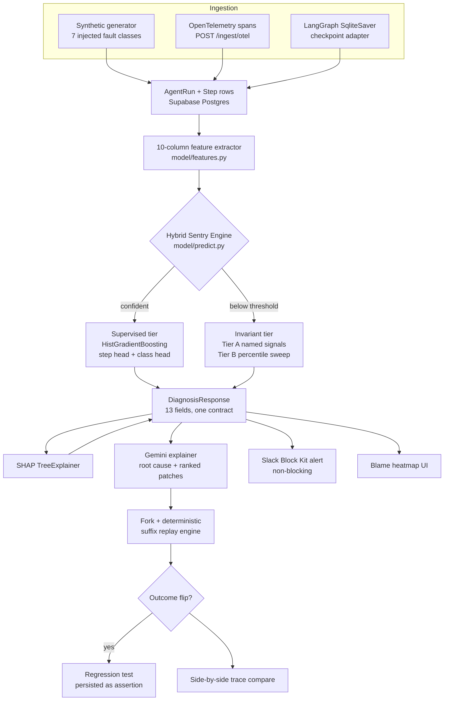

# Black Box — Project Master Guide

**Sentry for AI Agents.** Finds the exact step that broke an agent run, explains why,
and lets you fork from that step with a fix.

> **Status of this document.** Every number in it was measured on the running system
> during the audit of 2026-10-04, not estimated. Where a figure is weak or a claim is
> narrower than it sounds, this document says so in the same sentence. That is
> deliberate: the project's own `CLAUDE.md` carries the rule *"Report real numbers
> only. Never invent a metric,"* and a guide that oversells would violate the thing it
> is documenting.

---

## Table of contents

1. [Executive summary and pitch](#1-executive-summary-and-pitch)
2. [Complete technology stack](#2-complete-technology-stack)
3. [Architecture and system mechanics](#3-architecture-and-system-mechanics)
4. [Every feature, exhaustively](#4-every-feature-exhaustively)
5. [Complete website flow and user journey](#5-complete-website-flow-and-user-journey)
6. [Instructions for a downstream AI model](#6-instructions-for-a-downstream-ai-model)
7. [Five-minute demo pitch script](#7-five-minute-demo-pitch-script)
8. [Honest limitations](#8-honest-limitations)

---

## 1. Executive summary and pitch

### 1.1 The problem

An AI agent run is a chain of 10 to 20 interdependent steps: a model call picks a
tool, the tool returns data, that data seeds the next prompt, and so on. When the run
fails, the failure surfaces at the *end* — a wrong answer, a crash, a loop that never
terminates. The step that actually caused it is usually far upstream.

Conventional observability does not solve this:

| Tool class | What it gives you | Why it is not enough |
| --- | --- | --- |
| Error trackers (Sentry) | The stack frame that raised | Agent runs often fail with **no exception at all**. A stale cache hit returns HTTP 200 and poisons every later step |
| APM / tracing (Datadog) | Span durations, a waterfall | Tells you a span was *slow*, never that its **output was wrong**. No notion of semantic drift between steps |
| Log aggregation | Raw text, searchable | A human still has to read 20 steps of JSON and guess which one went bad |
| LLM-as-judge | A plausible natural-language opinion | Not reproducible, costs a call per diagnosis, and **degrades sharply on failure modes it has not seen** (measured below: 32.5% on held-out classes) |

Three capabilities are missing everywhere: **per-step attribution** (which step, not
which service), **state inspection** (what the prompt and tool schema actually were at
that step), and **deterministic replay** (prove a fix works without re-running a
non-deterministic agent from scratch).

### 1.2 The solution

Black Box ingests an agent trace, extracts a 10-column numeric feature vector per
step, scores every step for blame with a trained classifier, falls back to a
distribution-relative invariant tier when the classifier is not confident, explains the
flagged step in plain English with Gemini, and lets you **fork the run from that step**
with a patch and deterministically replay only the suffix.

**The core differentiator is that the localizer is a trained model, not an LLM
prompt.** That is what the held-out-class evaluation below is designed to prove, and
it is also where the honest caveat lives.

### 1.3 Headline numbers (measured 2026-10-04)

| Metric | Value | What it actually means |
| --- | --- | --- |
| **Trained-class top-1 accuracy** | **95.0%** | Correct step localized on the 5 fault classes present in training. n = 20 held-out *runs* of seen classes |
| **Held-out-class top-1, hybrid engine** | **52.5%** | Correct step on 2 fault classes the model **never saw in training**. n = 40 runs |
| Held-out-class top-1, **classifier alone** | **7.5%** | The supervised head by itself does **not** generalize. This number is why the invariant tier exists |
| Best baseline on held-out classes | **32.5%** | LLM-as-judge (Gemini). The hybrid engine beats it by **20 points** |
| Fault detection rate | **98.8%** | 168 of 170 failed runs carry a stored diagnosis |
| Corpus size | **279 runs** | Live in Supabase Postgres. Grows as forks are created |
| Top-3 accuracy, trained classes | **100%** | The right step is always in the top 3 |

**Baseline comparison, the number the whole pitch rests on:**

| Approach | Trained classes | Held-out classes |
| --- | --- | --- |
| Last step (naive) | 10.0% | 7.5% |
| First errored step | 5.0% | 10.0% |
| Anomaly heuristic | 30.0% | 0.0% |
| LLM-as-judge (Gemini) | 80.0% | 32.5% |
| **Black Box hybrid engine** | **95.0%** | **52.5%** |

Read the right-hand column honestly: *52.5% is not a good absolute score.* The claim
is comparative and narrow — on failure modes nobody trained for, a cheap local model
plus a distribution check beats an LLM judge by 20 points, deterministically and
without an API call. That is the claim. It is defensible. A broader one is not.

---

## 2. Complete technology stack

Versions below are read from `package.json` and the live interpreter, not from memory.

### Frontend

| Technology | Version | Role |
| --- | --- | --- |
| React | **19.2.8** | UI runtime |
| Vite | **8.3** | Dev server and bundler |
| TypeScript | **6.0** | Types. `tsc -b` is a release gate |
| Tailwind CSS | **4.3** | Styling, via the `@theme` token block |
| Framer Motion | **14.0** | Animation. Every usage honours `prefers-reduced-motion` |
| Recharts | **3.10.1** | Charts on the Model and Insights tabs. Lazy-loaded |
| oxlint | — | Linting |
| Custom path router | `src/lib/router.ts`, ~60 lines | History-API tab sync. **No react-router**: the only requirements are addressable tabs and a working `/trace/{run_id}` deep link |

### Backend

| Technology | Version | Role |
| --- | --- | --- |
| Python | **3.13.7** | Runtime (`.venv/`) |
| FastAPI | — | HTTP layer, 12 routes, OpenAPI at `/docs` |
| SQLModel + Pydantic v2 | — | ORM and the single source of truth for the diagnosis contract |
| **PostgreSQL via Supabase** | — | **Primary datastore.** Live dialect confirmed `postgresql`. SQLite exists only as a local fallback |
| httpx | — | Slack webhook delivery |

### ML and AI engine

| Technology | Role |
| --- | --- |
| scikit-learn `HistGradientBoostingClassifier` | The localizer. Two heads: step blame and fault class |
| SHAP `TreeExplainer` | Per-feature attribution, populates the `shap` contract field and the inspector bars |
| sentence-transformers `all-MiniLM-L6-v2` | Local embeddings for `semantic_deviation`. Runs on-device, no API |
| joblib | Artifact serialization into `model/artifacts/` |
| Google Gemini `gemini-3.5-flash-lite` | Plain-English root cause and ranked patch candidates, JSON-constrained output |

### Integrations

| Integration | Entry point |
| --- | --- |
| OpenTelemetry | `POST /ingest/otel`, OTLP-style JSON spans mapped into the trace schema |
| Slack | `backend/alerts.py`, Block Kit webhook, non-blocking |
| LangGraph | `ingest/langgraph_adapter.py`, reads `SqliteSaver` checkpoint history off the compiled graph |

> **Correction to a common misstatement.** This project is **not** on React 18, **not**
> on Python 3.11, and **not** SQLite-primary. If you are generating collateral from an
> older brief, use the table above.

---

## 3. Architecture and system mechanics

### 3.1 End-to-end pipeline



### 3.2 The 10-column feature vector

One row per step. These ten columns are the entire input to the model — there is no
raw text in the classifier, which is precisely why it can generalize across task types.

| # | Column | Type | What it captures |
| --- | --- | --- | --- |
| 1 | `duration_z` | float | Step latency, z-scored within the run. Catches hangs and suspiciously instant returns |
| 2 | `token_z` | float | Token count, z-scored within the run. Catches truncation and runaway generation |
| 3 | `retry_count` | int | Retries on this step |
| 4 | `parse_failure` | bool | Output failed to parse against its expected schema |
| 5 | `tool_choice_entropy` | float | Uncertainty in the tool-selection distribution. High entropy means the agent was guessing |
| 6 | `semantic_deviation` | float | Cosine distance between this step's output embedding and the run's trajectory. **The single strongest signal**, and what catches stale or hallucinated content that is syntactically perfect |
| 7 | `arg_novelty` | float | How unlike the training distribution this step's arguments are |
| 8 | `state_hash_repeat` | int | Times this exact state hash has already been seen. Non-zero means a loop |
| 9 | `downstream_error_count` | int | Errors occurring after this step. Propagation evidence |
| 10 | `position_ratio` | float | Normalized index in the run. Prevents positional bias from masquerading as signal |

`evidence` returns the raw values of all ten. `shap` returns the signed attribution for
all ten. Both always use these real column names — never invented keys.

### 3.3 The hybrid detection strategy

This is the technically interesting part and the honest part.

**Tier 1 — supervised.** The HistGradientBoosting step head scores every step; the
class head names the fault. If the class head's probability clears the threshold, the
diagnosis is returned with `predicted_class` set and `class_confidence` populated.

**Tier 2 — distribution-relative invariants.** When the class head is below threshold,
`predicted_class` becomes `"unknown"` and the invariant scanner takes over. It does not
classify. It finds the step that is most extreme *relative to the training
distribution*, and reports what it observed:

- **Tier A, named signals.** Two proven, hand-specified checks run first:
  `token_collapse` and `state_repetition`.
- **Tier B, class-agnostic sweep.** On a Tier A miss, every remaining feature gets a
  generic two-sided percentile check against the 1st and 99th percentiles of the
  training distribution, emitting `{feature}_low` or `{feature}_high` — for example
  `semantic_deviation_high`.

The tiering is not cosmetic. An earlier single-ranked-list design dropped
`infinite_loop` from 35% to 0% and the hybrid held-out score from 52.5% to 30.0%. Tier A
runs first specifically to protect the signals that are known to work.

**The invariant that holds everywhere:** `anomaly_signal` names an *observation*, never
a class. Whenever it is set, `predicted_class` is `"unknown"` and `class_confidence` is
`0.0`. The system declines to name a failure mode it was never taught. That selective
prediction is a feature, and `unknown_reason` always explains the refusal in plain
English.

### 3.4 The diagnosis contract

Defined once in `backend/models.py::DiagnosisResponse`, 13 fields, mirrored by every
consumer — the UI, the Slack alert, and the regression-test generator. A build-time
script (`frontend/scripts/check-contract.mjs`) validates 25 TypeScript interfaces
against the Pydantic models, so contract drift fails the build rather than reaching
production.

```json
{
  "run_id": "uuid",
  "flagged_step_index": 8,
  "confidence": 0.6032,
  "predicted_class": "stale_retrieval",
  "evidence_path": "step[8].output",
  "evidence": { "semantic_deviation": 0.6304, "state_hash_repeat": 3.0, "...": "all 10" },
  "shap": { "semantic_deviation": 1.8845, "position_ratio": 0.9936, "...": "all 10" },
  "step_scores": [1, 0, 1, 5, 2, 0, 13, 0, 60, 0, 5, 1, 10],
  "explanation": null,
  "suggested_fixes": [],
  "class_confidence": 0.995,
  "unknown_reason": null,
  "anomaly_signal": null
}
```

Two notes a downstream implementer needs:

- `step_scores` sums to **approximately** 100, not exactly. The underlying floats sum
  to 100.0 and are then rounded independently per step, so a 13-step run can total 98.
  The contract specifies `~100`. Do not assert exact equality.
- `explanation` and `suggested_fixes` are empty until `POST /runs/{id}/explain` is
  called. They are populated by Gemini on demand, not during diagnosis, so that
  diagnosis stays fast and offline-capable.

### 3.5 Deterministic suffix replay

A fork does not re-run the agent. It copies steps `0 .. from_step - 1` verbatim from
the parent, applies the patch at `from_step`, and deterministically re-executes only
the suffix. Verified in the audit: forking a 13-step `stale_retrieval` run at step 8
replayed **5 steps** and flipped the outcome from `failed` to `success`.

This matters for the pitch: it is why a fix can be *proven* in seconds, and why the
prefix is guaranteed identical so the side-by-side diff is meaningful.

### 3.6 API surface

All 11 PRD endpoints, plus `/settings`.

| Endpoint | Method | Description |
| --- | --- | --- |
| `/runs` | GET | List runs, filterable by status, class, source |
| `/runs/{id}` | GET | Full trace with steps and stored suspicion scores |
| `/runs/{id}/diagnose` | POST | Score every step, persist, return the structured JSON |
| `/runs/{id}/explain` | POST | Gemini root cause plus ranked suggested fixes |
| `/runs/{id}/fork` | POST | `{from_step, fix_payload, override_code}`. Replays the suffix |
| `/runs/{id}/compare/{other_id}` | GET | Aligned step-by-step diff |
| `/runs/{id}/similar` | GET | Past diagnoses with nearby feature vectors |
| `/runs/{id}/regression-test` | POST | Persist the confirmed fix as an assertion |
| `/model/evaluation` | GET | Per-class accuracy, held-out results, baselines |
| `/dashboard/reliability` | GET | Pass rate, failure mix, latency, tokens |
| `/ingest/otel` | POST | Accept OTel spans into the trace schema |
| `/settings` | GET | Read-only config status. Never returns secret values |

`POST /runs/{id}/diagnose` also accepts two optional headers, added by
`backend/engine_selector.py`: `X-Engine-Provider` selects a diagnosis engine
(`default`, `groq`, `custom_llm`, `webhook`, `air_gapped`) and `X-Engine-Key`
carries a bring-your-own key for one request. The local hybrid engine is the
default and the fallback for every failure mode, so diagnosis never fails
because an optional remote is down, and `X-Engine-Used` on the response names
the engine that actually ran. Endpoint URLs resolve from server-side
environment variables and never from the request, which is what stops the
header being an SSRF vector. Routing to Groq runs `model/judge.py`'s prompt,
making it the LLM-as-judge baseline served by Groq: 32.5% on held-out classes
against the hybrid engine's 52.5%, so it is a flexibility feature, not an
accuracy one.

---

## 4. Every feature, exhaustively

> **On the count.** `PRD.md` defines **18** numbered features. This section documents
> all 18, then adds the visual design system as item 19 — it is a real, substantial
> part of the product but it is a *design specification* in the PRD, not a numbered
> feature row. If you have seen "19 features" quoted, this is the reconciliation.

### P0 — the core, all complete

**1. Synthetic trace generator and seed corpus.** `generator/`. Produces realistic
multi-step agent traces across task types with faults injected deliberately, so ground
truth is known. `backend/seed_corpus.py` is an idempotent loader. **279 runs live**:
170 failed, 109 successful, spanning all 7 fault classes plus clean runs.

**2. Seven failure classes.** Five trained on, two held out entirely and never seen
during training:

| Class | Split | What it is |
| --- | --- | --- |
| `wrong_tool_chosen` | trained | Agent selected an inappropriate tool |
| `hallucinated_argument` | trained | Argument value invented, not derived from context |
| `stale_retrieval` | trained | Cached or outdated data returned as fresh |
| `premature_termination` | trained | Agent stopped before completing the task |
| `schema_violation` | trained | Output did not conform to the expected schema |
| `infinite_loop` | **held out** | Agent repeats a state cycle without progress |
| `context_truncation` | **held out** | Context window overflow silently dropped information |

The split is **by failure class, never random**. A random split would leak each class
into both sides and destroy the entire generalization claim.

**3. Ten-column feature extractor.** `model/features.py`. Section 3.2 above.

**4. Hybrid Sentry detection engine.** `model/predict.py`. Section 3.3 above.

**5. Model evaluation against four baselines.** `model/evaluate.py`. Last step, first
errored step, anomaly heuristic, and LLM-as-judge (Gemini). Plus leave-one-class-out
(mean 0.212) and the `unknown`-rate report. Numbers in section 1.3.

**6. Structured diagnosis API.** `POST /runs/{id}/diagnose`. Section 3.4.

**7. Blame heatmap and step timeline UI.** Every step colour-graded 0 to 100 by its
share of blame. The flagged step dominates visually. Click any step to open the
inspector.

**8. Fork with deterministic suffix replay.** Section 3.5. The demo's peak moment.

**9. Trace comparison, original versus fork.** `GET /runs/{id}/compare/{other_id}`,
rendering a changed-steps-only aligned diff.

### P1 — complete

**10. Gemini plain-English root cause.** `backend/explainer.py`. Seeded with the SHAP
attributions and raw evidence, JSON-constrained output.

**11. Field-level fault localization.** `evidence_path` points at
`step[8].output` or deeper, resolved by `model/predict.py::_resolve_evidence_path` from
the dominant SHAP feature. **Real, not null.** Best-effort: it is a pointer derived from
feature attribution, not ground truth.

**12. Suggested-fix diff view.** Red and green inside the terminal frame.

**13. LangGraph real-agent demo.** `ingest/langgraph_adapter.py`. Reads checkpoint
history and maps it into the trace schema, proving the system works on a real agent and
not only synthetic data. Two implementation notes discovered empirically:
`get_state_history` lives on the **compiled graph**, not on `SqliteSaver`; and the
`__start__` pseudo-node must be filtered out or it counts as a real step.

**14. Slack structured alert.** `backend/alerts.py`. Section 4.1 below.

### P2 — complete

**15. Multiple ranked fork candidates.** Gemini proposes 2 to 3 fixes; each is forked
independently against the live endpoint and the UI shows which actually passes.

**16. Diagnosis memory.** `GET /runs/{id}/similar`, cosine similarity over stored
diagnosis feature vectors. "This has happened before."

**17. Auto-generated regression test.** `POST /runs/{id}/regression-test` turns a
confirmed fix into a permanent assertion.

**18. OpenTelemetry ingest.** `POST /ingest/otel`. The interoperability claim.

**— Reliability dashboard.** `GET /dashboard/reliability` with Recharts on the Insights
tab: pass rate over time, failure mix, latency, token trends. Live values: 279 runs,
39.07% overall pass rate, 1,202,495 total tokens. **Cost is not displayed**, because no
token cost rate is configured and the system will not invent one — `estimated_cost_usd`
returns `null` and the UI omits the metric rather than fabricating it.

**21. Live agent runs.** `backend/demo_router.py`. `POST /demo/run-live`
synthesizes a trace with a chosen fault, persists it and diagnoses it in one
call, surfaced as the Runs tab's "Run live agent" tile. Reuses the real
generator and the real seeding path so demo runs share the training
distribution. Returns `localized_correctly`, since the injected fault makes
ground truth known. Not a PRD feature; added after the feature table.

**20. Pluggable diagnosis engines.** `backend/engine_selector.py`. An optional
`X-Engine-Provider` header on `POST /runs/{id}/diagnose` routes diagnosis to
Groq, a custom LLM, an enterprise webhook or an on-prem model, with the local
hybrid engine as both default and fallback for every failure mode. Endpoint
URLs resolve server-side, never from the request, so the header cannot be used
for SSRF. Only local and Groq have a service behind them today. Not a PRD
feature; added after the feature table was complete.

**19. Visual design system.** Dark, terminal-adjacent, no purple anywhere. Tokens:
bg `#0A0A0B`, panel `#111113`, border `#1F1F23`, text `#E8E8E8`, muted `#8A8A92`,
accent `#7DF9C4`, warn `#E8B14C`, critical `#E0574C`, pass `#5BC98C`. Space Grotesk for
headings, Geist for body, **Geist Mono for every piece of data** — step ids, JSON, field
paths, timestamps. Landing page carries an interactive ASCII hero with a cursor-driven
ripple, persistent mint glow on card borders, and a 3D spiral gallery of square cards.
Custom logo top-left. Verified in the audit: **zero emoji**, **zero purple**, **zero em
dashes in UI copy**, and 29 source files honour `prefers-reduced-motion`.

### 4.1 Where the Slack integration lives

| Piece | Location |
| --- | --- |
| Sender | `backend/alerts.py::send_diagnosis_alert` (line 79) |
| Payload builder | `backend/alerts.py::build_slack_payload` (line 29) |
| Trigger | `backend/main.py` line 444, inside `POST /runs/{id}/diagnose`, immediately after the diagnosis is persisted |
| Config | `SLACK_WEBHOOK_URL` in `.env` |
| UI readout | Settings tab, `slack_configured` from `GET /settings` |

Three deliberate behaviours:

1. **Never fires on `predicted_class: "unknown"`.** That is the invariant tier's honest
   "I don't know", not a finding worth paging a human about.
2. **Can never fail a diagnosis.** Guarded internally *and* at the call site; a Slack
   outage logs a warning and returns `False`.
3. **Deep-links to `/trace/{run_id}`**, which is the entire reason the custom router
   exists.

Block Kit structure: `header`, `section`, `section`, `actions`. No emoji, per the
project's own hard rules.

---

## 5. Complete website flow and user journey

### Stage 0 — Landing and sign-in

The visitor lands on a dark page with an interactive ASCII hero that ripples away from
the cursor, a 3D spiral gallery of square cards with persistent mint-glow borders, and a
closing section of four **honest** claim cards: it localizes rather than detects, the
classifier alone does not generalize (7.5%), the fallback tier is what carries the
unseen cases (52.5%), and a fork is a replay rather than a rerun. Every number on the
landing page is read from the real evaluation artifact.

Sign-in leads to the dashboard. Navigation is a **sticky top bar** with the logo at the
top left and six tabs. (`PRD.md` specifies a left sidebar; the top bar is a deliberate,
documented deviation at the product owner's request. Tab set and order are unchanged.)

### Stage 1 — Runs: survey the damage

The Runs tab lists all 279 runs in a high-density table: status, task type, injected
class, token count, duration, whether a diagnosis exists. A metrics header summarizes
pass rate and failure mix; a filter bar narrows by status, class and source. The user
scans for red.

### Stage 2 — Trace: find the step

Clicking a failed run opens the **blame heatmap**. Every step is colour-graded by its
share of blame, so the flagged step is visually unmissable — in the audit's
`stale_retrieval` run, step 8 scored 60 out of ~100 while its neighbours scored 0 to 13.
The timeline beneath shows sequence and duration.

The key insight the user has here: *the run failed at step 12, but the blame is at
step 8.* That gap is the entire product.

### Stage 3 — Step Inspector: understand why

Clicking the flagged step opens the inspector:

- **`evidence_path`** — a precise locator, `step[8].output`, in Geist Mono.
- **SHAP attribution bars** — which of the ten features drove the call. In the audit
  run: `semantic_deviation` 1.88, `position_ratio` 0.99, `downstream_error_count` 0.94.
- **Raw evidence values** for all ten columns.
- **Gemini explanation** — plain English, on demand via `POST /runs/{id}/explain`.
- If the invariant tier fired instead, **`unknown_reason`** explains the refusal in
  plain English rather than guessing a class.

### Stage 4 — Fork: prove the fix

The user supplies a patch, or takes one of Gemini's ranked candidates, and forks from
the flagged step. Multiple candidates can be forked in parallel and the UI shows which
one actually passes.

The system replays only the suffix. In the audit: forked at step 8, **5 of 13 steps
replayed**, status flipped `failed` → `success`. The red-to-green flip is the demo's peak
moment, and it is real — a deterministic re-execution, not a model's opinion that the
fix looks reasonable.

### Stage 5 — Regression test: make it permanent

`POST /runs/{id}/regression-test` persists the confirmed fix as an assertion, so the
same failure cannot silently return.

### Stage 6 — Forks: lineage and diff

The Forks tab renders a lineage tree built client-side from `parent_run_id` links, plus
a compare-any-two picker producing a changed-steps-only side-by-side diff. Because the
prefix is replayed verbatim, the diff isolates exactly what the patch changed.

### Stage 7 — Insights: the aggregate picture

Recharts over `GET /dashboard/reliability`: pass rate over time, failure-class mix,
latency and token trends. Cost is deliberately absent until a rate is configured.

### Stage 8 — Model: the credibility tab

Where a technical evaluator goes to check the work. A grouped horizontal bar chart of
all four baselines against the hybrid engine, trained versus held-out, with the engine's
own row highlighted and a reference line at the held-out gate. Beneath it, a per-class
radar chart comparing the raw classifier against the hybrid engine, which makes the
`infinite_loop` weakness (35%) visible rather than buried.

### Stage 9 — Settings: configuration

Read-only status: Gemini configured, Slack configured, database dialect, model artifact
present, trained versus held-out classes, dashboard base URL. **It never returns secret
values** — only whether each is configured. It is read-only because no persistence layer
for settings exists, and showing an editable form that silently discards input would be
a lie told in UI.

---

## 6. Instructions for a downstream AI model

If you are an AI model reading this file to produce collateral, follow these rules.

### 6.1 Non-negotiable constraints

1. **Never invent a metric.** Every number you emit must appear in this document or be
   measured live. If a slide needs a number this file does not contain, say so instead
   of filling the gap.
2. **Always pair 52.5% with its context.** Quoting it alone is misleading in both
   directions — it sounds weak without "on failure classes never seen in training,
   versus 32.5% for an LLM judge", and it sounds like general accuracy without "the
   classifier alone scores 7.5%".
3. **Say "localizes", not "detects".** The system is given a failed run and finds the
   responsible step. It is not a monitor that discovers failures on its own.
4. **No emoji, no purple, no em dashes** in any generated UI copy. These are hard rules
   in `CLAUDE.md`.
5. **Use Geist Mono for all data** in any mockup: step ids, JSON, field paths,
   timestamps.
6. **Do not describe the stack as React 18, Python 3.11, or SQLite-primary.** See
   section 2.
7. **Never present Groq or any other provider as an upgrade.** Routing to Groq
   runs the LLM-as-judge baseline: 32.5% held out against the hybrid engine's
   52.5%. It is a flexibility feature and it makes localization worse. Say so.
8. **Only local and Groq are wired.** The custom-LLM, webhook and air-gapped
   providers have transport and fallback but no deployed service. Do not imply
   a working integration that does not exist.

### 6.2 Where to find things

| You need | Go to |
| --- | --- |
| Problem framing, why Sentry/Datadog fail | §1.1 |
| Any performance number | §1.3 |
| Exact library versions | §2 |
| Architecture diagram | §3.1 |
| The ten features | §3.2 |
| Why the hybrid tier exists | §3.3 |
| The JSON contract | §3.4 |
| Feature inventory | §4 |
| Slack specifics | §4.1 |
| Engine providers, Groq caveat | §4 item 20, §3.6 |
| User journey, screen by screen | §5 |
| Demo timing | §7 |
| What not to overclaim | §8 |

### 6.3 Per-artifact guidance

- **Pitch deck.** Lead with §1.1's table (why existing tools fail), then the §1.3
  baseline comparison as the single money slide, then the fork flip as the demo. Close
  on §8 — a judge who finds a limitation you already disclosed trusts everything else
  you said.
- **Demo video script.** Use §7 verbatim as the spine, §5 for what is on screen at each
  beat.
- **User guide.** §5 is already in journey order. Add §3.6 as an API appendix.
- **Technical sales collateral.** Lead with §3.3 and §3.5 — the hybrid tier and
  deterministic replay are the two genuinely defensible engineering claims.
- **Judge or reviewer Q&A.** Pre-read §8. Every hard question is already there.

---

## 7. Five-minute demo pitch script

### 0:00 – 0:40 · The problem

> "An AI agent run is twenty steps where each one feeds the next. When it fails, it
> fails at the end — but the step that *caused* it is usually ten steps upstream.
>
> Sentry can't help: most agent failures throw no exception at all. A stale cache hit
> returns a clean 200 and quietly poisons every step after it. Datadog tells you a span
> was slow, never that its output was wrong. So an engineer opens twenty steps of JSON
> and starts guessing.
>
> Black Box is Sentry for AI agents. It finds the exact step, explains why, and lets you
> fork from that step with a fix."

### 0:40 – 1:20 · The run

*Runs tab, 279 runs. Click a failed `stale_retrieval` run.*

> "279 real traces. This one failed. Here's the blame heatmap — every step scored for
> how much it contributed.
>
> Notice the gap. The run threw at step 12. The blame is at **step 8**, scored 60 out of
> 100 while its neighbours are near zero. Step 8 returned a cached rate quote and
> everything after it inherited the bad number. That gap is the whole product."

### 1:20 – 2:10 · The evidence

*Open the Step Inspector.*

> "Not a vibe. `evidence_path` points at `step[8].output`. Underneath, SHAP
> attributions: `semantic_deviation` at 1.88 is doing the work — this step's output
> drifted hard from the run's trajectory even though it parsed perfectly. That's the
> signal a schema validator can never catch.
>
> And Gemini turns that into plain English. But notice the ordering: the model localizes
> first, the LLM explains second. The LLM is never the judge."

### 2:10 – 3:00 · The fork — the peak

*Apply the patch, fork at step 8.*

> "Here's the part nobody else does. I fork from step 8 with a fix.
>
> It does **not** re-run the agent. Steps 0 through 7 are copied verbatim, the patch
> lands at step 8, and only the five-step suffix re-executes deterministically.
>
> *[flip]* Red to green. Failed to success. Five steps replayed. That's not a model
> saying the fix looks reasonable — that's an execution proving it. And because the
> prefix is identical, the side-by-side diff shows exactly what changed."

### 3:00 – 4:10 · The credibility slide

*Model tab.*

> "Here's where I'd expect you to push back, so let me get ahead of it.
>
> On the five fault classes we trained on: **95%**. Fine, but any supervised model
> should do that.
>
> The real test is two classes the model has **never seen** — held out entirely, split
> by class, never randomly, because a random split would leak them and the number would
> be meaningless.
>
> On those: last-step heuristic 7.5%. First-errored-step 10%. Anomaly heuristic 0%. An
> **LLM-as-judge using Gemini: 32.5%.** Black Box: **52.5%.**
>
> Now, two honest things. 52.5% is not a good absolute score. And our classifier *by
> itself* gets 7.5% — it does not generalize at all. What gets us to 52.5% is a second
> tier: when the classifier isn't confident, we stop classifying and run a
> distribution-relative check that asks which step is most extreme versus the training
> distribution. It reports an observation, never a class name, and it says `unknown`
> out loud.
>
> So the claim is narrow and it's comparative: on failures nobody trained for, a cheap
> local model that knows when to shut up beats an LLM judge by twenty points —
> deterministically, with no API call."

### 4:10 – 4:40 · The surface area

*Insights, then Settings.*

> "It closes the loop. Confirmed fixes persist as regression tests. Similar past
> diagnoses surface by cosine search. Aggregate reliability on the dashboard — and note
> there's no cost figure there, because we haven't configured a token rate and we won't
> invent one.
>
> It ingests from OpenTelemetry and from LangGraph checkpoints, so it's not locked to
> our synthetic data. Diagnoses page Slack automatically, with one rule: it never pages
> you for an `unknown`."

### 4:40 – 5:00 · Close

> "One trained model, one JSON contract, every consumer reading the same shape.
>
> It finds the step, proves the fix by replaying it, and tells you when it doesn't know.
> That last part is why you can trust the first two."

---

## 8. Honest limitations

Carry these into every conversation. Disclosing them is what makes the rest credible.

1. **52.5% on held-out classes is not good in absolute terms.** The claim is strictly
   comparative, against four baselines, on two classes.
2. **The supervised classifier alone does not generalize** — 7.5% on held-out classes.
   The hybrid tier is doing the work. Never present the classifier as the thing that
   generalizes.
3. **The evaluation set is small.** 20 seen-class runs and 40 held-out-class runs.
   Confidence intervals are wide. Treat these as directional.
4. **The invariant tier is not fully assumption-free.** Tier A's two named signals were
   chosen with knowledge of what was held out. Only Tier B's percentile sweep is
   genuinely class-agnostic. Do not claim the whole tier is assumption-free.
5. **`infinite_loop` is the weak class** at 35%, well below `context_truncation` at 70%.
   The radar chart on the Model tab shows this rather than hiding it.
6. **`evidence_path` is a best-effort pointer, not ground truth.** It is derived from the
   dominant SHAP feature and can point at the right step but the wrong field.
7. **Most of the corpus is synthetic.** Faults are injected, so ground truth is known —
   which is what makes the evaluation possible, and also means real-world distributions
   may differ. The LangGraph adapter exists to start closing that gap.
8. **LOCO mean is 0.212**, flat across classes. Reported, not hidden.
9. **No cost metric.** Token cost rate is unconfigured, so `estimated_cost_usd` is
   `null` and the UI omits it.
10. **Settings is read-only** because no settings persistence layer exists.
11. **The top bar deviates from `PRD.md`**, which specifies a left sidebar. Deliberate,
    at the product owner's request, documented in `components/TopNav.tsx`.
12. **Only two diagnosis engines are actually wired**, local and Groq. The
    custom-LLM, webhook and air-gapped providers have working transport and
    fallback but no deployed service behind them, and the UI labels them as
    such rather than implying a live switch.

---

## Appendix — Running it

```bash
# Backend
.venv/Scripts/python.exe -m uvicorn backend.main:app --port 8000

# Frontend
cd frontend && npm run dev

# Full test suite (224 tests)
.venv/Scripts/python.exe -m pytest -q

# Integration check
.venv/Scripts/python.exe -m backend.test_backend

# Type + contract gate
cd frontend && npm run verify && npx tsc -b
```

| Surface | URL |
| --- | --- |
| Dashboard | http://localhost:5173/ |
| API docs | http://localhost:8000/docs |

---

*Audited and generated 2026-10-04. Every figure measured on the running system.*
