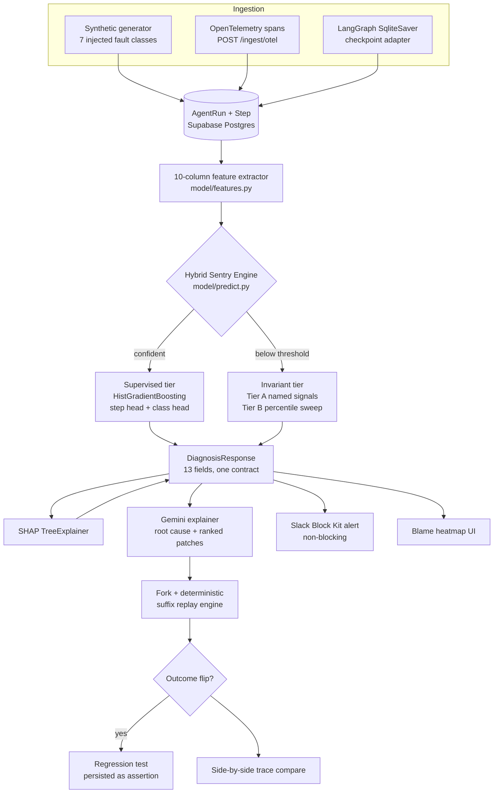

# Black Box — Sentry & Deterministic Replay for AI Agents

**Finds the exact step that broke an agent run, explains why, and lets you fork from that step with a fix.**


-32.5%25-8A8A92?style=flat-square)


> **Every number in this README was measured on the running system, not estimated.**
> Where a figure is weak or a claim is narrower than it sounds, this README says so in
> the same sentence. The project's own `CLAUDE.md` carries the rule *"Report real
> numbers only. Never invent a metric"* — a README that oversold would violate the
> thing it documents.


---

## Table of contents

- [1. The problem](#1-the-problem)
- [2. What Black Box does](#2-what-black-box-does)
- [3. Measured results](#3-measured-results)
- [4. Architecture](#4-architecture)
- [5. The 10-column feature system](#5-the-10-column-feature-system)
- [6. Hybrid detection strategy](#6-hybrid-detection-strategy)
- [7. Technology stack](#7-technology-stack)
- [8. Feature inventory](#8-feature-inventory)
- [9. API surface and the diagnosis contract](#9-api-surface-and-the-diagnosis-contract)
- [10. User journey](#10-user-journey)
- [11. Integrations](#11-integrations)
- [12. Honest limitations](#12-honest-limitations)
- [13. Quickstart](#13-quickstart)
- [14. Verification](#14-verification)
- [15. Repository layout](#15-repository-layout)

---

## 1. The problem

An AI agent run is a chain of 10 to 20 interdependent steps: a model call picks a tool,
the tool returns data, that data seeds the next prompt, and so on. When the run fails,
it fails at the **end** — a wrong answer, a crash, a loop that never terminates. The
step that actually caused it is usually far upstream.

Conventional observability does not close this gap:

| Tool class | What it gives you | Why it is not enough for agents |
| --- | --- | --- |
| **Error trackers** (Sentry) | The stack frame that raised | Agent runs often fail with **no exception at all**. A stale cache hit returns HTTP 200 and quietly poisons every step after it |
| **APM / tracing** (Datadog) | Span durations, a waterfall | Tells you a span was *slow*, never that its **output was wrong**. No notion of semantic drift between steps |
| **Log aggregators** | Raw text, searchable | A human still has to read 20 steps of JSON and guess which one went bad |
| **LLM-as-a-judge** | A plausible natural-language opinion | Not reproducible, costs an API call per diagnosis, and **degrades sharply on failure modes it has not seen** — measured at 32.5% on held-out classes |

Three capabilities are missing everywhere:

1. **Per-step attribution** — which *step*, not which service.
2. **State inspection** — what the prompt, arguments and tool schema actually were at that step.
3. **Deterministic replay** — prove a fix works without re-running a non-deterministic agent from scratch.

## 2. What Black Box does

Black Box ingests an agent trace, extracts a **10-column numeric feature vector per
step**, scores every step for blame with a **trained classifier**, falls back to a
**distribution-relative invariant tier** when the classifier is not confident, explains
the flagged step in plain English with Gemini, and lets you **fork the run from that
step** with a patch and deterministically replay only the suffix.

**The core differentiator is that the localizer is a trained model, not an LLM prompt.**
That is what the held-out-class evaluation is designed to prove — and section 12 is
where the honest caveats live.

Three properties worth stating up front:

- **It localizes, it does not detect.** You hand it a failed run; it finds the
  responsible step. It is not a monitor that discovers failures on its own.
- **A fork is a replay, not a rerun.** The prefix is copied verbatim, so an outcome flip
  is execution proving a fix, not a model opining that the fix looks reasonable.
- **It says `unknown` out loud.** When the classifier is not confident, the system
  declines to name a failure mode it was never taught, and explains the refusal.

## 3. Measured results

Measured 2026-10-04 on the live system.

### Headline metrics

| Metric | Value | What it actually means |
| --- | --- | --- |
| **Trained-class top-1** | **95.0%** | Correct step localized on the 5 fault classes present in training (n = 20 runs) |
| **Held-out top-1, hybrid engine** | **52.5%** | Correct step on 2 fault classes **never seen in training** (n = 40 runs) |
| **Held-out top-1, classifier alone** | **7.5%** | The supervised head by itself does **not** generalize. This is why the invariant tier exists |
| **Fault detection rate** | **98.7%** | 155 of 157 failed runs carry a stored diagnosis |
| **Trained-class top-3** | **100%** | The right step is always in the top 3 |
| **Corpus** | **258 runs** | 157 failed, 101 successful, all 7 fault classes. Grows as forks are created |
| **LOCO mean** | **0.212** | Leave-one-class-out, flat across classes. Reported, not hidden |

### Baseline comparison — the number the pitch rests on

| Approach | Trained classes | Held-out classes |
| --- | --- | --- |
| Last step (naive) | 10.0% | 7.5% |
| First errored step | 5.0% | 10.0% |
| Anomaly heuristic | 30.0% | 0.0% |
| LLM-as-a-judge (Gemini) | 80.0% | 32.5% |
| **Black Box hybrid engine** | **95.0%** | **52.5%** |

### Per-class breakdown

| Class | Split | Hybrid top-1 |
| --- | --- | --- |
| `schema_violation` | trained | 100% |
| `hallucinated_argument` | trained | 100% |
| `stale_retrieval` | trained | 100% |
| `premature_termination` | trained | 100% |
| `wrong_tool_chosen` | trained | 75% |
| `context_truncation` | **held out** | 70% |
| `infinite_loop` | **held out** | 35% |

**Read the held-out column honestly.** 52.5% is not a good absolute score. The claim is
comparative and narrow: *on failure modes nobody trained for, a cheap local model plus a
distribution check beats an LLM judge by 20 points, deterministically and without an API
call.* That claim is defensible. A broader one is not.

The split is **by failure class, never random**. A random split would leak each class
into both sides and make the entire generalization claim meaningless.

## 4. Architecture



### Deterministic suffix replay

A fork does **not** re-run the agent. It copies steps `0 .. from_step - 1` verbatim from
the parent, applies the patch at `from_step`, and deterministically re-executes only the
suffix.

Verified: forking a 13-step `stale_retrieval` run at step 8 replayed **5 steps** and
flipped the outcome from `failed` to `success`. Because the prefix is guaranteed
identical, the side-by-side diff isolates exactly what the patch changed.

## 5. The 10-column feature system

One row per step. These ten columns are the **entire** input to the model — there is no
raw text in the classifier, which is precisely why it transfers across task types.

| # | Column | Type | What it captures |
| --- | --- | --- | --- |
| 1 | `duration_z` | float | Step latency, z-scored within the run. Catches hangs and suspiciously instant returns |
| 2 | `token_z` | float | Token count, z-scored within the run. Catches truncation and runaway generation |
| 3 | `retry_count` | int | Retries on this step |
| 4 | `parse_failure` | bool | Output failed to parse against its expected schema |
| 5 | `tool_choice_entropy` | float | Uncertainty in the tool-selection distribution. High entropy means the agent was guessing |
| 6 | `semantic_deviation` | float | Cosine distance between this step's output embedding and the run's trajectory. **The strongest single signal** — catches stale or hallucinated content that is syntactically perfect |
| 7 | `arg_novelty` | float | How unlike the training distribution this step's arguments are |
| 8 | `state_hash_repeat` | int | Times this exact state hash has already been seen. Non-zero means a loop |
| 9 | `downstream_error_count` | int | Errors occurring after this step. Propagation evidence |
| 10 | `position_ratio` | float | Normalized index in the run. Prevents positional bias from masquerading as signal |

`evidence` returns the raw values of all ten. `shap` returns the signed attribution for
all ten. Both always use these real column names — never invented keys.

## 6. Hybrid detection strategy

### Tier 1 — supervised

The `HistGradientBoostingClassifier` runs two heads: a **step head** that scores every
step for blame, and a **class head** that names the fault. If the class head's
probability clears `CONFIDENCE_THRESHOLD`, the diagnosis returns with `predicted_class`
set and `class_confidence` populated.

### Tier 2 — distribution-relative invariants

When the class head falls below threshold, `predicted_class` becomes `"unknown"` and the
invariant scanner takes over. It does not classify. It finds the step most extreme
*relative to the training distribution* and reports what it observed:

- **Tier A — named signals.** Two proven, hand-specified checks run first:
  `token_collapse` and `state_repetition`.
- **Tier B — class-agnostic sweep.** On a Tier A miss, every remaining feature gets a
  generic two-sided percentile check against the 1st and 99th percentiles of the
  training distribution, emitting `{feature}_low` or `{feature}_high` (for example
  `semantic_deviation_high`).

**The tiering is not cosmetic.** An earlier single-ranked-list design dropped
`infinite_loop` from 35% to 0% and the hybrid held-out score from 52.5% to 30.0%. Tier A
runs first specifically to protect the signals known to work.

### The invariant that always holds

`anomaly_signal` names an **observation, never a class**. Whenever it is set:

- `predicted_class` is `"unknown"`
- `class_confidence` is `0.0`
- `unknown_reason` explains the refusal in plain English

This is selective prediction, and it is a feature. A system that declines to guess is
one you can trust when it does not.

## 7. Technology stack

### Frontend

| Technology | Version | Role |
| --- | --- | --- |
| React | **19.2.8** | UI runtime |
| Vite | **8.3** | Dev server and bundler |
| TypeScript | **6.0** | `tsc -b` is a release gate |
| Tailwind CSS | **4.3** | Styling via the `@theme` token block |
| Framer Motion | **14.0** | Animation. Every usage honours `prefers-reduced-motion` |
| Recharts | **3.10.1** | Charts on Model and Insights. Lazy-loaded into a shared chunk |
| oxlint | — | Linting |
| Custom path router | `src/lib/router.ts` (~60 lines) | History-API tab sync. **No react-router** — the only requirements are addressable tabs and a working `/trace/{run_id}` deep link |

### Backend

| Technology | Version | Role |
| --- | --- | --- |
| Python | **3.13.7** | Runtime (`.venv/`) |
| FastAPI | ≥0.115 | HTTP layer, 12 routes, OpenAPI at `/docs` |
| SQLModel + Pydantic v2 | ≥0.0.22 / ≥2.9 | ORM, and the single source of truth for the diagnosis contract |
| **PostgreSQL via Supabase** | — | **Primary datastore.** SQLite exists only as a local fallback |
| httpx | ≥0.27 | Slack webhook delivery. No SDK — it is one HTTP POST |

### ML and AI

| Technology | Role |
| --- | --- |
| scikit-learn `HistGradientBoostingClassifier` | The localizer. Step head + class head |
| SHAP `TreeExplainer` | Per-feature attribution. Populates the `shap` field and the inspector bars |
| sentence-transformers `all-MiniLM-L6-v2` | Local embeddings for `semantic_deviation`. Runs on-device, no API |
| joblib | Artifact serialization into `model/artifacts/` |
| Google Gemini `gemini-3.5-flash-lite` | Plain-English root cause and ranked patch candidates, JSON-constrained |

### Integrations

| Integration | Entry point |
| --- | --- |
| OpenTelemetry | `POST /ingest/otel` — OTLP-style JSON spans mapped into the trace schema |
| Slack | `backend/alerts.py` — Block Kit webhook, non-blocking |
| LangGraph | `ingest/langgraph_adapter.py` — reads `SqliteSaver` checkpoint history |

## 8. Feature inventory

> `PRD.md` defines **18** numbered features. All 18 are documented below, followed by the
> visual design system as item 19 — it is a substantial part of the product, but a
> *design specification* in the PRD rather than a numbered feature row.

### P0 — core

**1. Synthetic trace generator and seed corpus.** `generator/` produces realistic
multi-step traces with faults injected deliberately, so ground truth is known.
`backend/seed_corpus.py` is an idempotent loader. 258 runs live.

**2. Seven failure classes.**

| Class | Split | What it is |
| --- | --- | --- |
| `wrong_tool_chosen` | trained | Agent selected an inappropriate tool |
| `hallucinated_argument` | trained | Argument value invented, not derived from context |
| `stale_retrieval` | trained | Cached or outdated data returned as fresh |
| `premature_termination` | trained | Agent stopped before completing the task |
| `schema_violation` | trained | Output did not conform to the expected schema |
| `infinite_loop` | **held out** | Agent repeats a state cycle without progress |
| `context_truncation` | **held out** | Context window overflow silently dropped information |

**3. Ten-column feature extractor.** `model/features.py`. See section 5.

**4. Hybrid Sentry detection engine.** `model/predict.py`. See section 6.

**5. Evaluation against four baselines.** `model/evaluate.py` — last step, first errored
step, anomaly heuristic, LLM-as-a-judge. Plus leave-one-class-out and the `unknown`-rate
report.

**6. Structured diagnosis API.** `POST /runs/{id}/diagnose`. See section 9.

**7. Blame heatmap and step timeline UI.** Every step colour-graded 0 to 100 by its share
of blame. The flagged step dominates visually.

**8. Fork with deterministic suffix replay.** See section 4.

**9. Trace comparison.** `GET /runs/{id}/compare/{other_id}` — aligned, changed-steps-only diff.

### P1

**10. Gemini plain-English root cause.** `backend/explainer.py`, seeded with SHAP
attributions and raw evidence, JSON-constrained output.

**11. Field-level fault localization.** `evidence_path` points at `step[8].output` or
deeper, resolved from the dominant SHAP feature. Real, not null. Best-effort: a pointer
derived from attribution, not ground truth.

**12. Suggested-fix diff view.** Red and green inside the terminal frame.

**13. LangGraph real-agent demo.** `ingest/langgraph_adapter.py`. Proves the system works
on a real agent, not only synthetic data.

**14. Slack structured alert.** `backend/alerts.py`. See section 11.

### P2

**15. Multiple ranked fork candidates.** Gemini proposes 2 to 3 fixes; each is forked
independently against the live endpoint and the UI shows which actually passes.

**16. Diagnosis memory.** `GET /runs/{id}/similar` — cosine similarity over stored
diagnosis feature vectors. "This has happened before."

**17. Auto-generated regression test.** `POST /runs/{id}/regression-test` turns a
confirmed fix into a permanent assertion.

**18. OpenTelemetry ingest.** `POST /ingest/otel`.

**— Reliability dashboard.** `GET /dashboard/reliability` with Recharts on Insights:
pass rate over time, failure mix, latency, token trends. Live: 258 runs, 39.15% pass
rate, 1,116,813 total tokens. **Cost is deliberately absent** — no token rate is
configured, so `estimated_cost_usd` returns `null` and the UI omits the metric rather
than fabricating one.

**19. Visual design system.** Dark, terminal-adjacent, no purple anywhere.

| Token | Hex | | Token | Hex |
| --- | --- | --- | --- | --- |
| bg | `#0A0A0B` | | accent | `#7DF9C4` |
| panel | `#111113` | | warn | `#E8B14C` |
| border | `#1F1F23` | | critical | `#E0574C` |
| text | `#E8E8E8` | | pass | `#5BC98C` |
| muted | `#8A8A92` | | | |

Space Grotesk for headings, Geist for body, **Geist Mono for every piece of data** — step
ids, JSON, field paths, timestamps. The landing page carries an interactive ASCII hero
with a cursor-driven ripple, persistent mint glow on card borders, and a 3D spiral
gallery of square cards. Audited: **zero emoji, zero purple, zero em dashes in UI copy**,
and 29 source files honour `prefers-reduced-motion`.

## 9. API surface and the diagnosis contract

| Endpoint | Method | Description |
| --- | --- | --- |
| `/runs` | GET | List runs, filterable by status, class, source |
| `/runs/{id}` | GET | Full trace with steps and stored suspicion scores |
| `/runs/{id}/diagnose` | POST | Score every step, persist, return the structured JSON |
| `/runs/{id}/explain` | POST | Gemini root cause plus ranked suggested fixes |
| `/runs/{id}/fork` | POST | `{from_step, fix_payload, override_code}`. Replays the suffix |
| `/runs/{id}/compare/{other_id}` | GET | Aligned step-by-step diff |
| `/runs/{id}/similar` | GET | Past diagnoses with nearby feature vectors |
| `/runs/{id}/regression-test` | POST | Persist the confirmed fix as an assertion |
| `/model/evaluation` | GET | Per-class accuracy, held-out results, baselines |
| `/dashboard/reliability` | GET | Pass rate, failure mix, latency, tokens |
| `/ingest/otel` | POST | Accept OTel spans into the trace schema |
| `/settings` | GET | Read-only config status. **Never returns secret values** |

### The diagnosis contract

Defined once in `backend/models.py::DiagnosisResponse`, **13 fields**, mirrored by every
consumer — the UI, the Slack alert and the regression-test generator. A build-time script
(`frontend/scripts/check-contract.mjs`) validates **23 TypeScript interfaces** against
the Pydantic models, so contract drift fails the build rather than reaching production.

```json
{
  "run_id": "02d93cf4-83a9-49bf-92e6-22aa6d79ef09",
  "flagged_step_index": 8,
  "confidence": 0.6032,
  "predicted_class": "stale_retrieval",
  "evidence_path": "step[8].output",
  "evidence": {
    "semantic_deviation": 0.6304,
    "duration_z": -1.188,
    "token_z": -1.1168,
    "arg_novelty": null,
    "tool_choice_entropy": null,
    "state_hash_repeat": 3.0,
    "retry_count": 0.0,
    "parse_failure": false,
    "downstream_error_count": 0.0,
    "position_ratio": 0.9231
  },
  "shap": {
    "semantic_deviation": 1.8845,
    "position_ratio": 0.9936,
    "downstream_error_count": 0.9404,
    "duration_z": 2.015,
    "arg_novelty": -1.0147,
    "tool_choice_entropy": -0.4039,
    "state_hash_repeat": 0.2517,
    "token_z": -0.051,
    "parse_failure": -0.0605,
    "retry_count": 0.0008
  },
  "step_scores": [1, 0, 1, 5, 2, 0, 13, 0, 60, 0, 5, 1, 10],
  "explanation": null,
  "suggested_fixes": [],
  "class_confidence": 0.995,
  "unknown_reason": null,
  "anomaly_signal": null
}
```

Two notes for anyone consuming this:

- **`step_scores` sums to approximately 100, not exactly.** The underlying floats sum to
  100.0 and are then rounded independently per step, so a 13-step run can total 98. The
  contract specifies `~100`. Do not assert exact equality.
- **`explanation` and `suggested_fixes` are empty until `POST /runs/{id}/explain` is
  called.** They are populated by Gemini on demand, not during diagnosis, so that
  diagnosis stays fast and fully offline-capable.

## 10. User journey

### Landing

A dark page with an interactive ASCII hero that ripples away from the cursor, a 3D spiral
gallery of square glowing cards, and a closing section of four deliberately **honest**
claim cards: it localizes rather than detects, the classifier alone does not generalize
(7.5%), the fallback tier carries the unseen cases (52.5%), and a fork is a replay rather
than a rerun. Every number is read from the real evaluation artifact.

Navigation is a **sticky top bar** with the logo top-left and six tabs. (`PRD.md`
specifies a left sidebar; the top bar is a deliberate, documented deviation. Tab set and
order are unchanged.)

### `/runs` — survey the damage

All 258 runs in a high-density table: status, task type, injected class, tokens,
duration, whether a diagnosis exists. A metrics header summarizes pass rate and failure
mix; a filter bar narrows by status, class and source.

### `/trace/:id` — find the step

The **blame heatmap**. Every step colour-graded by its share of blame, so the flagged
step is unmissable — in the reference `stale_retrieval` run, step 8 scores 60 while its
neighbours score 0 to 13.

**The key insight: the run failed at step 12, but the blame is at step 8.** That gap is
the entire product.

### Step Inspector — understand why

- **`evidence_path`** — a precise locator, `step[8].output`, in Geist Mono
- **SHAP attribution bars** — `semantic_deviation` 1.88, `position_ratio` 0.99, `downstream_error_count` 0.94
- **Raw evidence** for all ten columns
- **Gemini explanation** on demand
- If the invariant tier fired, **`unknown_reason`** explains the refusal rather than guessing

### Fork — prove the fix

Supply a patch, or take one of Gemini's ranked candidates. Multiple candidates fork in
parallel and the UI shows which passes. The system replays only the suffix: forked at
step 8, 5 of 13 steps replayed, `failed` → `success`.

### `/forks` — lineage and diff

A lineage tree built client-side from `parent_run_id` links, plus a compare-any-two
picker producing a changed-steps-only diff. Because the prefix is replayed verbatim, the
diff isolates exactly what the patch changed.

### `/insights` — the aggregate picture

Recharts over `GET /dashboard/reliability`: pass rate over time, failure-class mix,
latency and token trends.

### `/model` — the credibility tab

Where a technical evaluator checks the work. A grouped horizontal bar chart of all four
baselines against the hybrid engine, trained versus held-out, with a reference line at
the held-out gate. Beneath it, a per-class radar chart comparing the raw classifier
against the hybrid engine — which makes the `infinite_loop` weakness (35%) visible rather
than buried.

### `/settings` — configuration

Read-only status: Gemini configured, Slack configured, database dialect, model artifact
present, trained versus held-out classes. **It never returns secret values** — only
whether each is configured. Read-only because no settings persistence layer exists, and
an editable form that silently discarded input would be a lie told in UI.

## 11. Integrations

### Slack

| Piece | Location |
| --- | --- |
| Sender | `backend/alerts.py::send_diagnosis_alert` (line 79) |
| Payload builder | `backend/alerts.py::build_slack_payload` (line 29) |
| Trigger | `backend/main.py` line 444, inside `POST /runs/{id}/diagnose`, right after persistence |
| Config | `SLACK_WEBHOOK_URL` |
| UI readout | Settings tab, `slack_configured` |

Three deliberate behaviours:

1. **Never fires on `predicted_class: "unknown"`.** That is the invariant tier's honest
   "I don't know", not a finding worth paging a human about.
2. **Can never fail a diagnosis.** Guarded internally *and* at the call site — a Slack
   outage logs a warning and returns `False`.
3. **Deep-links to `/trace/{run_id}`**, which is the entire reason the custom router exists.

Block Kit structure: `header`, `section`, `section`, `actions`. No emoji.

### OpenTelemetry

`POST /ingest/otel` accepts OTLP-style JSON spans and maps them into the `AgentRun` /
`Step` schema, so traces from an existing OTel pipeline can be diagnosed without
rewriting instrumentation.

### LangGraph

`ingest/langgraph_adapter.py` reads checkpoint history and maps it into the trace schema.
Two implementation details discovered empirically and worth knowing if you extend it:

- **`get_state_history` lives on the compiled graph, not on `SqliteSaver`.** The adapter
  takes the graph, not the checkpointer.
- **The `__start__` pseudo-node must be filtered out**, or it counts as a real step and
  shifts every index by one. The adapter assigns a sequential `real_index`.

## 12. Honest limitations

Disclosing these is what makes the rest credible.

1. **52.5% on held-out classes is not good in absolute terms.** The claim is strictly
   comparative, against four baselines, on two classes.
2. **The supervised classifier alone does not generalize** — 7.5% on held-out classes.
   The hybrid tier does the work. Never present the classifier as the thing that
   generalizes.
3. **The evaluation set is small.** n = 20 seen-class runs, n = 40 held-out-class runs.
   Confidence intervals are wide; treat these as directional.
4. **The invariant tier is not fully assumption-free.** Tier A's two named signals were
   chosen with knowledge of what was held out. Only Tier B's percentile sweep is
   genuinely class-agnostic.
5. **`infinite_loop` is the weak class** at 35%, well below `context_truncation` at 70%.
   The Model tab's radar chart shows this rather than hiding it.
6. **`evidence_path` is a best-effort pointer, not ground truth.** Derived from the
   dominant SHAP feature; it can point at the right step but the wrong field.
7. **Most of the corpus is synthetic.** Faults are injected, which is what makes the
   evaluation possible — and also means real-world distributions may differ. The
   LangGraph adapter exists to start closing that gap.
8. **LOCO mean is 0.212**, flat across classes.
9. **No cost metric.** Token cost rate is unconfigured, so `estimated_cost_usd` is `null`
   and the UI omits it.
10. **Settings is read-only** because no settings persistence layer exists.
11. **The top bar deviates from `PRD.md`**, which specifies a left sidebar. Deliberate,
    at the product owner's request, documented in `components/TopNav.tsx`.

## 13. Quickstart

### Prerequisites

- Python **3.13**
- Node.js **20+**
- A Supabase Postgres instance (or omit `DATABASE_URL` to fall back to local SQLite)

### 1. Backend environment

```bash
python -m venv .venv
.venv/Scripts/activate        # Windows
# source .venv/bin/activate   # macOS / Linux

pip install -r requirements.txt
```

### 2. Configure `.env`

```bash
cp .env.example .env
```

Fill in the keys you need. **Never commit `.env`.**

| Variable | Required | Purpose |
| --- | --- | --- |
| `DATABASE_URL` | recommended | Supabase Postgres connection string. Omit for local SQLite |
| `GEMINI_API_KEY` | for explain | Google Gemini free-tier key |
| `GEMINI_MODEL` | no | Defaults to `gemini-3.5-flash-lite` |
| `SLACK_WEBHOOK_URL` | no | Enables alerts. Everything degrades gracefully without it |
| `DASHBOARD_BASE_URL` | for alerts | Base for Slack deep links, `{base}/trace/{run_id}`. Defaults to `http://localhost:5173`. **Set this in any deployed environment** or every alert links people at their own laptop |
| `CONFIDENCE_THRESHOLD` | no | Below this, the class head returns `unknown`. Defaults to `0.5` |
| `MODEL_PATH` | no | Defaults to `model/artifacts/localizer.joblib` |
| `EMBEDDING_MODEL` | no | Defaults to `sentence-transformers/all-MiniLM-L6-v2` |
| `LLM_PROVIDER` | no | Defaults to `gemini` |
| `API_BASE_URL` | no | Where the backend listens. Informational only — the frontend reads its own `VITE_API_BASE_URL` from `frontend/.env`, since Vite exposes only `VITE_`-prefixed vars to the browser |
| `SUPABASE_*` | no | Only if you enable hosted auth |

The frontend has its own template. Copy it only if the API is not on
`http://localhost:8000`:

```bash
cp frontend/.env.example frontend/.env   # sets VITE_API_BASE_URL
```

### 3. Generate data and train (optional — artifacts ship in the repo)

```bash
python -m generator.generate      # synthetic traces, 7 injected fault classes
python -m model.features          # extract the 10-column vectors
python -m model.train             # fit the HistGradientBoosting localizer
python -m model.evaluate          # baselines, held-out eval, LOCO
python -m backend.seed_corpus     # idempotent load into the database
```

### 4. Run both servers

```bash
# Terminal 1 — backend
.venv/Scripts/python.exe -m uvicorn backend.main:app --port 8000

# Terminal 2 — frontend
cd frontend
npm install
npm run dev
```

| Surface | URL |
| --- | --- |
| Dashboard | http://localhost:5173/ |
| API docs | http://localhost:8000/docs |

## 14. Verification

```bash
# Full Python suite — 166 tests
.venv/Scripts/python.exe -m pytest -q

# End-to-end integration check against a live DB
.venv/Scripts/python.exe -m backend.test_backend

# Frontend: type-check + lint + TS↔Pydantic contract sync (23/23)
cd frontend && npm run verify

# Strict project build
cd frontend && npx tsc -b

# Production bundle
cd frontend && npm run build
```

Expected on a healthy tree:

| Check | Expected |
| --- | --- |
| `pytest -q` | 166 passed |
| `backend.test_backend` | `TEST: PASSED` |
| `npm run verify` | `contract check passed. DiagnosisResponse carries 13 keys.` |
| `npx tsc -b` | no output |
| `npm run build` | no size warning. Main bundle ~147 kB gzip, Recharts in a separate ~105 kB chunk |

> `pytest.ini` scopes collection to this project's four test packages. Without it, a bare
> `pytest` also sweeps the vendored `ui-ux-pro-max-skill/`, which ships duplicate test
> basenames and errors out during collection.

## 15. Repository layout

```
.
├── generator/      synthetic trace generator, 7 injected fault classes
├── model/          feature extraction, training, evaluation, SHAP
│   └── artifacts/  localizer.joblib, evaluation.json, metrics.json
├── backend/        FastAPI app, SQLModel schema, diagnosis contract, fork
│   ├── main.py     12 endpoints
│   ├── models.py   DiagnosisResponse — the contract, source of truth
│   ├── alerts.py   Slack Block Kit, non-blocking
│   └── explainer.py  Gemini root cause + ranked patches
├── ingest/         LangGraph checkpointer adapter, OTel span mapping
├── replay/         checkpointed replay, deterministic suffix re-execution
├── frontend/       React + Vite + TypeScript dashboard
│   ├── src/views/    the six tabs
│   ├── src/lib/      router.ts
│   └── scripts/      check-contract.mjs
├── PRD.md                    full product spec
├── PROJECT_MASTER_GUIDE.md   exhaustive technical + pitch reference
├── PROJECT_STATUS.md         engineering log and decision record
└── CLAUDE.md                 always-on agent context and hard rules
```

---

**Black Box** — it finds the step, proves the fix by replaying it, and tells you when it
does not know. That last part is why you can trust the first two.
